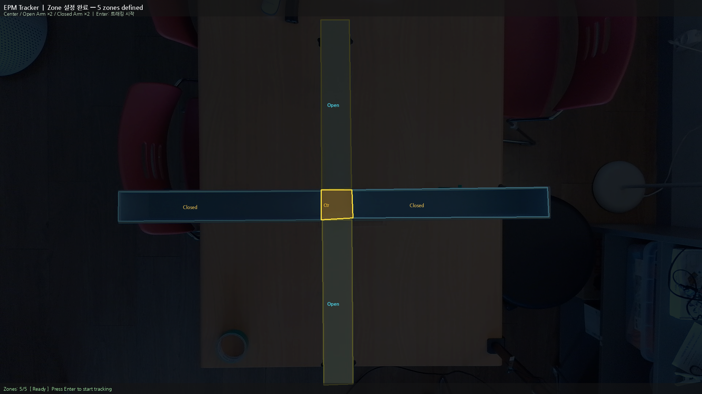
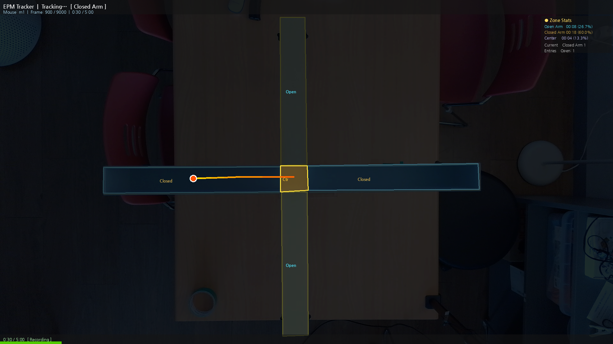
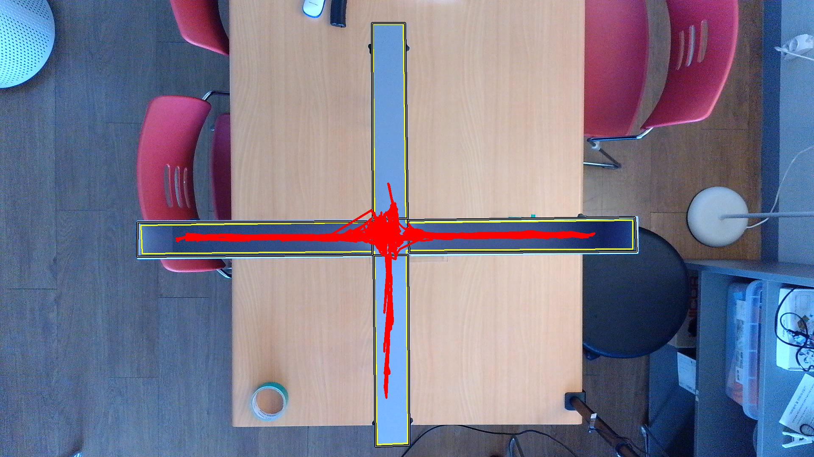
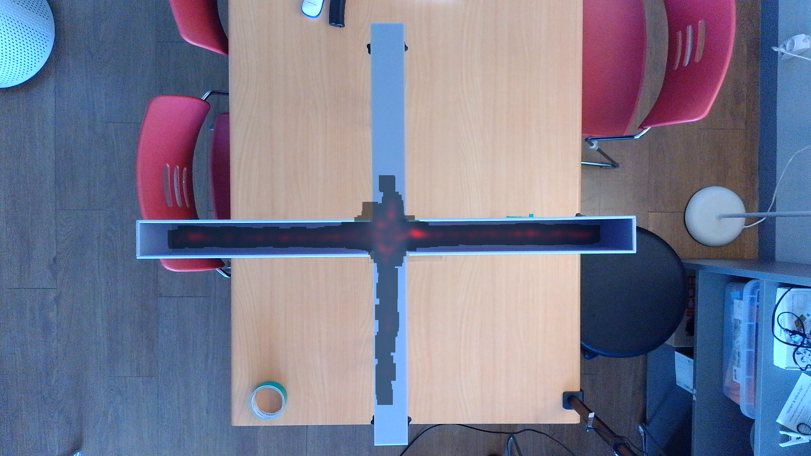
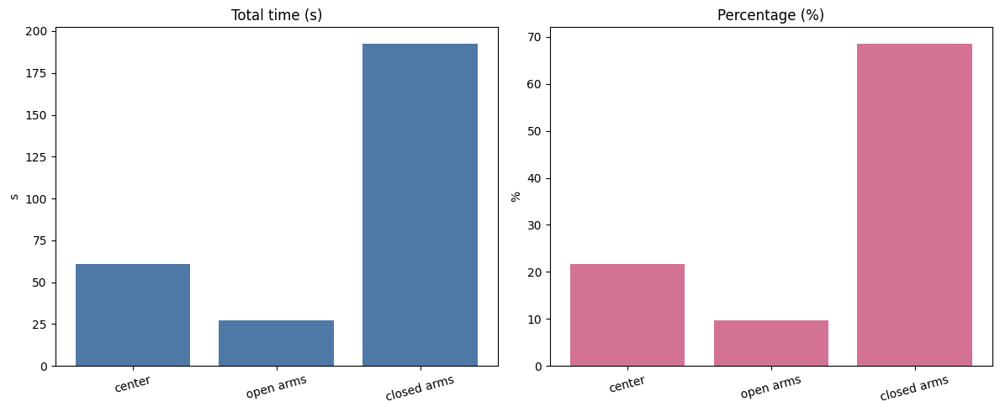
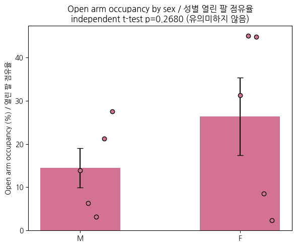
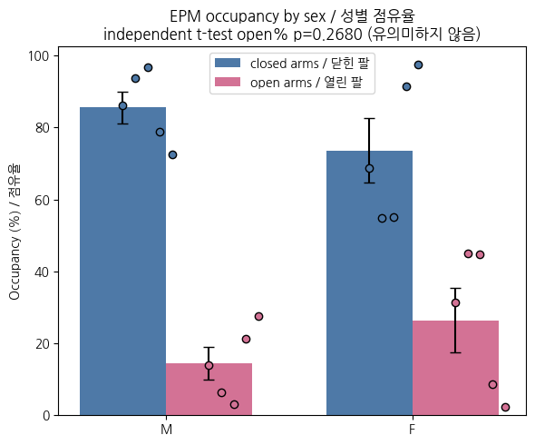
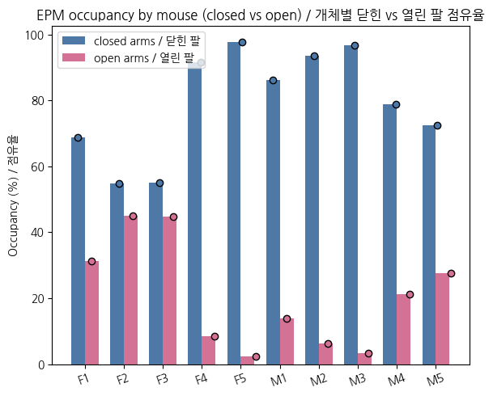
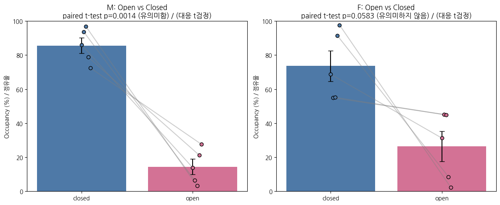
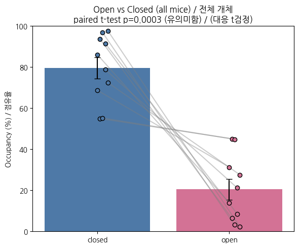

# EPM Tracker (Elevated Plus Maze)

**GitHub:** https://github.com/gdrpaul3-byte/hsmu_epm-tracker-v1

마우스 Elevated Plus Maze(EPM) 영상에서 자동으로 이동 경로를 추적하고, Open/Closed Arm 체류 시간을 분석하는 Python/OpenCV 도구입니다.

---

## 프로그램 실행 화면

<p align="center">
  
  
</p>
<p align="center">
  <em>좌: Zone 설정 완료 (5구역 색상 오버레이) &nbsp;|&nbsp; 우: 트래킹 중 (Closed Arm 체류, 실시간 비율 표시)</em>
</p>

---

## 출력 그래프 예시

<p align="center">
  
  
  
  
</p>
<p align="center">
  <em>Track Plot &nbsp;|&nbsp; Heatmap &nbsp;|&nbsp; Zone Stats &nbsp;|&nbsp; Open Arm % 성별 비교 (마우스 m1 예시)</em>
</p>

<p align="center">
  
  
  
  
</p>
<p align="center">
  <em>Open/Closed 시간 (성별) &nbsp;|&nbsp; Open/Closed 시간 (개체별) &nbsp;|&nbsp; Paired 비교 (성별) &nbsp;|&nbsp; Paired 비교 (개체별)</em>
</p>

---

## 폴더 구조

```
epm/
├── src/
│   ├── epm_tracker.py              ← 메인 EPM 트래커
│   ├── epm_track_plotter.py        ← 트래킹 경로 시각화
│   └── analyze_epm_open_closed.py  ← Open/Closed Arm 분석
├── archive/                        ← 이전 버전 (참고용)
├── data/
│   ├── videos/                     ← 원본 영상 (.mp4, gitignore 처리)
│   ├── tracks/                     ← 트래킹 결과 CSV
│   ├── configs/                    ← ROI/Zone JSON
│   ├── plots/                      ← 분석 그래프 (.png)
│   └── student_submissions/        ← 학생 제출 파일 (.zip, gitignore 처리)
├── assets/
│   └── NanumGothic*.ttf
└── docs/
    └── screenshots/                ← 프로그램 실행 화면 캡처
```

---

## 환경 설정

```bash
conda activate opencv_312
# 또는
pip install -r requirements.txt
```

## 실행 방법

### 1. 트래커 실행
```bash
cd epm
python src/epm_tracker.py --video data/videos/m1_epm.mp4
```

### 2. Open/Closed Arm 분석
```bash
python src/analyze_epm_open_closed.py
```

### 3. 트래킹 경로 플롯
```bash
python src/epm_track_plotter.py
```

### Zone 구성
| Zone | 색상 | 설명 |
|---|---|---|
| Center | 주황 | 교차 중앙 |
| Open Arm × 2 | 하늘 | 개방된 팔 |
| Closed Arm × 2 | 갈색 | 벽 있는 팔 |

---

## 대용량 파일 안내

`data/videos/` 의 mp4 파일은 `.gitignore`로 제외됩니다. 영상 파일은 별도 공유 링크로 배포합니다.

## 의존성

```
opencv-python
numpy
Pillow
pandas
matplotlib
```
